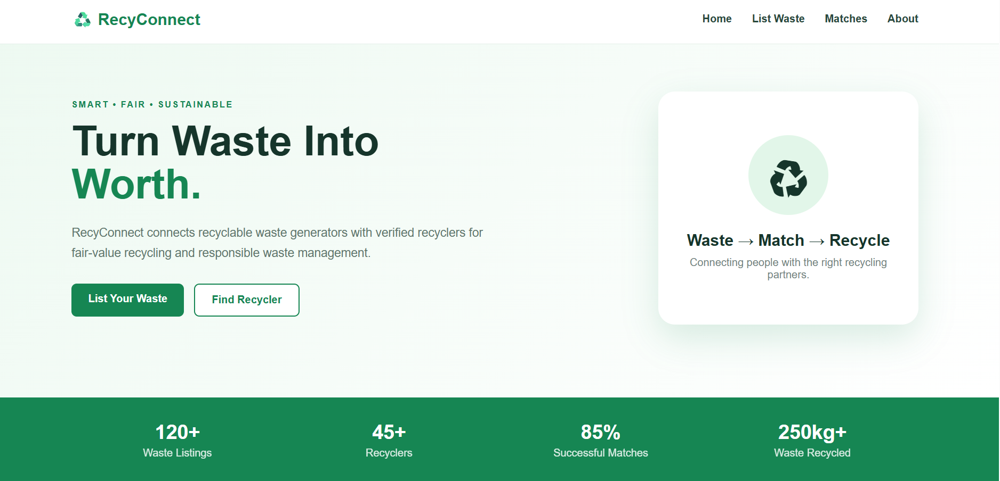

# RecyConnect

**RecyConnect** is a smart and user-friendly waste management platform designed to make recycling easier, more accessible, and more rewarding. It connects users with recycling services and helps encourage responsible waste disposal through a simple digital experience.

## 🌱 Features

* ♻️ Easy waste/recycling request management
* 📊 Interactive dashboard
* 📍 Recycling-related information and services
* 🔔 User-friendly notifications and status updates
* 📱 Responsive design for mobile and desktop
* 🎨 Clean and modern interface
* ⚡ Fast and easy-to-use experience
* 🌍 Promotes sustainable waste management

## 🛠️ Technologies Used

* **HTML5** – Structure
* **CSS3** – Styling & responsive design
* **JavaScript** – Interactivity and functionality

## 📂 Project Structure

```text
RecyConnect/
│
├── index.html
├── style.css
├── script.js
├── screenshot
└── README.md
```

## 🚀 Getting Started

### Run Locally

1. Clone this repository.
2. Open the project folder.
3. Open `index.html` in your browser.

Or use **VS Code Live Server** for a better development experience.

## 🌐 Live Demo

**Live Demo:** https://shashi-code07.github.io/RecyConnect/

## 📸 Screenshots



## 🎯 Future Improvements

* Real-time recycling pickup tracking
* Location-based recycling center suggestions
* User authentication
* Reward/points system
* Backend database integration
* AI-based waste classification
* Admin management panel

## 💡 Why RecyConnect?

Recycling can be difficult when people don't know **what to recycle, where to recycle it, or how to request recycling services**. RecyConnect aims to make this process simpler through one easy-to-use platform.

## 👩‍💻 Developer

**Shashi Tiwari**
B.Tech 3rd Year – Computer Science Engineering

---

### ⭐ Acknowledgement

Built with the goal of promoting **cleaner communities, responsible waste disposal, and a sustainable future.** 🌍♻️

